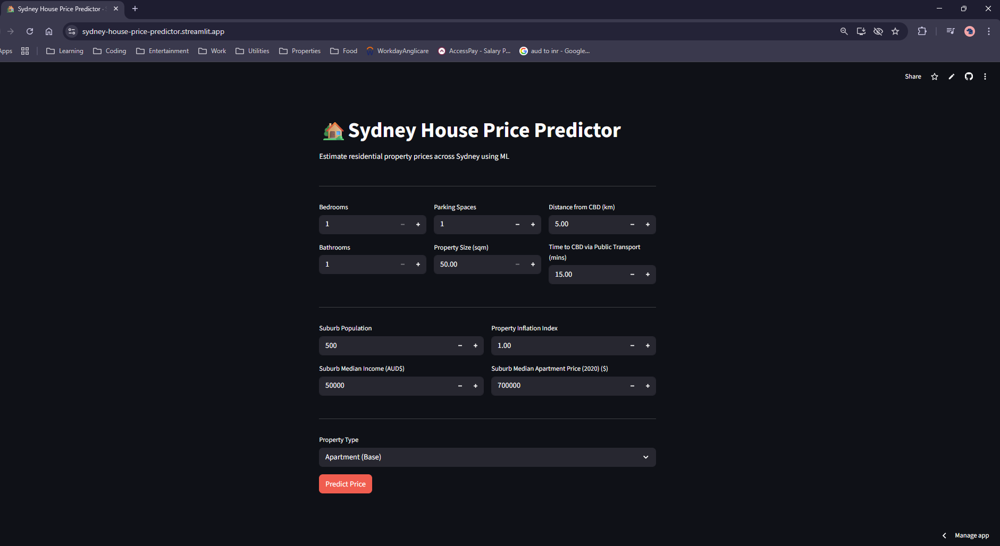
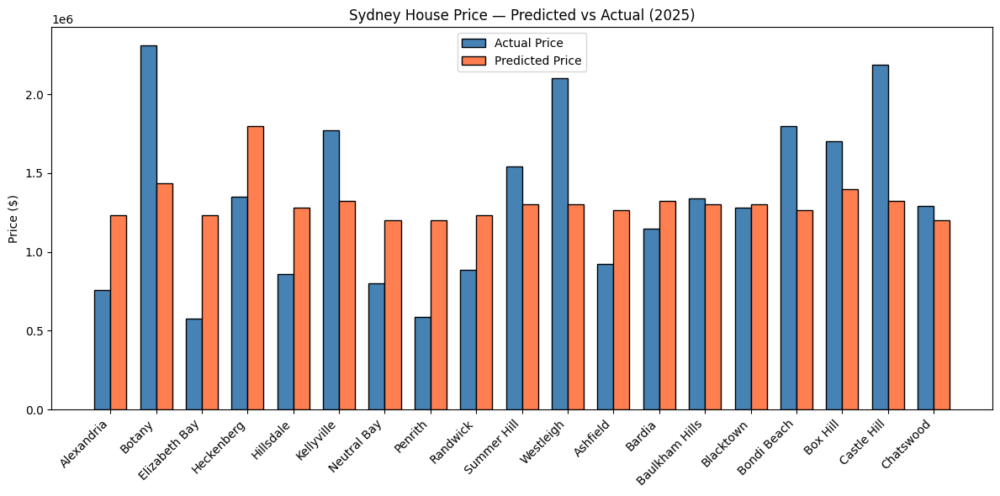

# 🏠 Sydney House Price Predictor

[](https://sydney-house-price-predictor.streamlit.app)
[](https://www.python.org/)
[](https://scikit-learn.org/)

A machine learning web application that predicts residential property prices across Sydney using historical property and socioeconomic data. Built to assist buyers, sellers, and policy makers with data-driven property valuations.

🔗 **[Try the Live App](https://sydney-house-price-predictor.streamlit.app)**

---

## App Preview



---

## Project Overview

This project builds an end-to-end machine learning pipeline to predict Sydney house prices. Starting from raw property listings and suburb socioeconomic data, the pipeline covers data cleaning, feature engineering, model selection, deployment, and real-world validation against 2025 sale prices.

**Key Results:**
- Best model: Random Forest Regressor
- R² Score: 0.8455
- RMSE: 0.2157
- Trained on ~11,000 Sydney property listings

---

## Methodology

**Data Collection:** Two datasets merged — Domain.com.au property listings and Sydney suburb socioeconomic review data covering ~11,000 observations across Sydney.

**Data Cleaning:** Standardised column formats, handled missing values with median imputation, removed subjective suburb rating features, capped property feature outliers, and applied log transformations to normalise skewed distributions including price, property size and rental prices.

**Feature Engineering:** Created four interaction terms capturing combined property effects — bedroom count × property size, bathroom count × property size, suburb median income × distance from CBD, and parking spaces × suburb median income. Property types consolidated into five categories and one-hot encoded.

**Model Selection:** Eight models trained and evaluated — Baseline Linear Regression, Linear Regression with Interactions, Ridge, Lasso, ElasticNet, Baseline Decision Tree, Tuned Decision Tree, and Random Forest. Random Forest selected as the best performer across all metrics.

**Explainability:** SHAP analysis applied to the Random Forest model to identify the most influential features driving price predictions.

---

## Model Comparison

| Model | RMSE | MSE | MAE | R² |
|---|---|---|---|---|
| Linear Regression | 0.2361 | 0.0557 | 0.1743 | 0.8149 |
| Linear + Interactions | 0.2358 | 0.0556 | 0.1742 | 0.8153 |
| Ridge Regression | 0.2357 | 0.0556 | 0.1740 | 0.8155 |
| Lasso Regression | 0.2358 | 0.0556 | 0.1740 | 0.8153 |
| ElasticNet | 0.2358 | 0.0556 | 0.1740 | 0.8153 |
| Decision Tree | 0.2798 | 0.0783 | 0.2019 | 0.7400 |
| Tuned Decision Tree | 0.2527 | 0.0638 | 0.1831 | 0.7880 |
| **Random Forest** | **0.2157** | **0.0465** | **0.1524** | **0.8455** |

---

## Key Insights

**Distance from CBD is the strongest predictor.** Properties closer to Sydney's CBD command significantly higher prices, with the relationship being non-linear — the premium increases sharply within 10km.

**Suburb median income outperforms property features.** Socioeconomic suburb characteristics are more predictive than individual property attributes like bedroom count alone, highlighting the importance of location over property size in Sydney's market.

**Interaction terms improve linear model performance.** Combining bedroom count with property size and suburb income with CBD distance captures relationships that individual features miss, closing the gap between linear models and tree-based models.

**Random Forest handles non-linearity effectively.** The 4% R² gap between Ridge Regression and Random Forest reflects Sydney's complex, non-linear pricing dynamics that regularised linear models cannot fully capture.

---

## Real World Validation

The model was validated against 19 recently sold Sydney properties scraped from Domain.com.au in February 2025.



**Mean Absolute Error: $424,521 | Mean % Error: 37.7%**

The elevated real-world error is attributable to three factors. First, the model was trained on 2020-2021 data during COVID-era market conditions when interest rates were at historic lows and prices were artificially inflated. Sydney prices have since corrected and restabilised at different levels. Second, suburb-level features such as median income and apartment prices used in validation are approximated with training data medians rather than current suburb-specific values. Third, property size was unavailable from the scraper and approximated with a median assumption.

This highlights a key production consideration — models trained on historically distorted data require retraining on post-correction data to remain accurate.

---

## Project Structure
```
Sydney-House-Price-Predictor/
├── app/
│   └── app.py                 # Streamlit web application
├── assets/                    # Screenshots and plots
├── data/
│   ├── raw/                   # Original datasets (see data/raw/README.md)
│   ├── processed/             # Cleaned and merged dataset
│   └── validation/            # 2025 real world validation data
├── models/
│   └── best_rf_model.pkl      # Trained Random Forest model
├── notebooks/
│   └── house_price_predictions.ipynb  # Full analysis notebook
├── src/
│   └── data/
│       └── scraper.py         # Domain.com.au data scraper
├── .gitignore
├── Dockerfile
├── README.md
└── requirements.txt
```

---

## How to Run Locally

**Prerequisites:** Python 3.11+, WSL2 recommended on Windows
```bash
# Clone the repository
git clone https://github.com/atharvakatkar/Sydney-House-Price-Predictor.git
cd Sydney-House-Price-Predictor

# Create virtual environment
uv venv
source .venv/bin/activate

# Install dependencies
uv pip install -r requirements.txt

# Run the app
streamlit run app/app.py
```

Download the raw datasets from Kaggle (see `data/raw/README.md`) and place them in `data/raw/` before running the notebook.

---

## Future Work

- Retrain on post-2022 data to reflect current market conditions
- Add current RBA interest rate as a feature — one of the strongest macro predictors of Sydney property prices
- Incorporate property size into the scraper for more accurate real-world validation
- Implement automated retraining pipeline as new Domain.com.au sales data becomes available
- Expand suburb-level features with current ABS census data
- Add suburb-level price maps using Folium or Plotly

---

## Tech Stack

Python, Pandas, NumPy, Scikit-Learn, SHAP, Streamlit, Joblib, Selenium, Matplotlib, Seaborn

---

## Author

**Atharva Katkar**  
[GitHub](https://github.com/atharvakatkar)

*Data Science Student — Macquarie University*